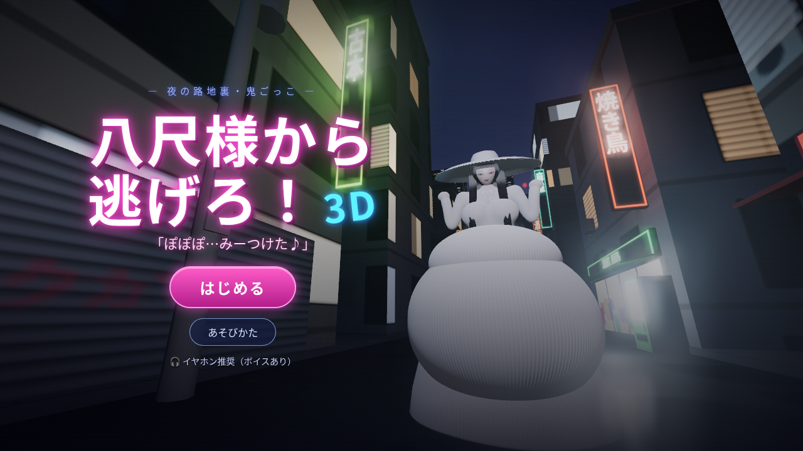

# 八尺様から逃げろ！3D

お腹がとても大きい八尺様から、夜の町を逃げ回る一人称3Dの鬼ごっこゲームです（ホラーコメディ）。
ブラウザだけで動きます。インストールやビルドは不要です。



## あそびかた
- 八尺様に捕まらないように、夜の路地裏を逃げ回ってください。生き延びた時間がスコアになります。
- プレイヤーは最初から速く走れます（秒速6m。ダッシュもスタミナもありません）。八尺様（秒速2.9〜3.3m）より速いので、ひらけた場所なら引き離せます。でも行き止まりや路地に追いこまれると、近くからの飛びかかりで捕まります。
- 近づかれると**捕まって**、お腹に押しつけられます。**お腹を連打**すると脱出できます（8〜12回くらい。かんたんです）。脱出したあとは少しのあいだ無敵になります。
- 逃げ続けると八尺様は**イライラ**してきます。メーターが満タンになるたびにお腹が**段階的に巨大化**します（上限はありません）。
  - Lv.1で小さな建物、Lv.2で中くらいの建物、Lv.3からはどんな建物でもお腹で押しつぶせるようになります。
  - お腹が大きくなるほど、八尺様の足は遅くなります（Lv.2で秒速2.5〜2.8m、Lv.4で秒速2.1〜2.4m、Lv.6以上で秒速1.7〜2.0m）。そのかわり、体が大きくなるぶん通せんぼされやすくなります。
  - プレイヤーを捕まえると、イライラが少しおさまります。
- ハートは3つです。捕まるたびに1つ減り、0になったらゲームオーバーです。

## 操作
| | PC | スマホ・タブレット |
|---|---|---|
| 移動 | WASD／矢印キー | 左スティック（左下・触れた場所に出ます） |
| 視点 | マウス（クリックで視点操作を開始） | 右スティック（右下・上下左右、上も大きく見上げられます） |
| スティック表示 | T キーで切り替え（PCでも2本スティックを使えます） | 常に表示 |
| お腹をたたく（捕まったとき） | クリック／スペースを連打 | タップを連打 |
| 一時停止 | Esc | ❚❚ ボタン |

🎧 ボイスと立体音響があるので、イヤホンでのプレイがおすすめです。

## 起動のしかた
ES Modules を使っているので、`index.html` をダブルクリックで直接開くのではなく、ローカルサーバー経由で開いてください。

```bash
cd hachishaku3d
python3 -m http.server 8000
# ブラウザで http://localhost:8000/ を開く
```

`npx serve` など、ほかの静的サーバーでも動きます。外部CDNは使っていません（three.js は `vendor/` に入っています）。
そのため、フォルダをそのまま GitHub Pages に置くだけで公開できます（`.nojekyll` 同梱）。

## しくみ
- **3D描画**：three.js r169（`vendor/three/`）。ブルーム、霧、影、ネオンの動的ライトを使っています。描画が重いときは自動で解像度を下げます。
- **八尺様**：画像は使わず、three.js で手続き的にモデリングしています（白いつば広帽子、ぱっつん前髪の黒髪ロング、ポロ襟とボタンのついたリブニットの白いワンピース、巨大なお腹）。
  - 上半身（胴体・胸・腕・首）は、符号付き距離関数（SDF）でなめらかに形を作り、Surface Nets で継ぎ目のない高ポリゴンのメッシュにしています。そこにボーンを入れた SkinnedMesh なので、関節を動かしてもパーツが離れません。
  - お腹は、まん丸の大きな下腹と、その上に乗った小さめの上腹の二段構えです。間にはくっきりしたくびれ（しわ）があります。どの段階まで大きくなっても、全方向に丸くふくらみます。
  - ニットの縦リブは、シェーダーで法線と陰影を手続き的につけています（光沢感のあるシーン、回り込む柔らかい光つき）。
  - 顔は参考画像に寄せて、切れ長の半目、赤いくちびる、上の歯が見える余裕の笑みにしています。
  - お腹はバネの物理演算で揺れます。足音、たたかれたとき、建物にぶつかったとき、巨大化したときに、それぞれぷるんと波打ちます。
  - 歩く速さに合わせて足が動き、スカートのすそも足に押されて揺れます。腕の振りや上半身の上下もつけています。
  - 髪（`js/hair.js`）：細い毛束を描いたテクスチャを貼った「ヘアカード」を、何層にも重ねています。毛先は細くなります。Kajiya-Kay 方式の異方性ハイライトで、サラサラのツヤの帯が出ます。ぱっつん前髪、胸にかかる横の髪、腰の下まである後ろ髪でできています。後ろ髪と横の髪は、ばねでつないだチェーンで揺れます。歩く、振り向く、お腹がはずむといった動きに遅れてついてきて、毛束ごとに揺れ方が少しずつ違います。
- **捕まったとき（めり込み）**：お腹の頂点シェーダーで、プレイヤーの位置にへこみを作ります。へこみのふちは、やわらかく盛り上がります。カメラはお腹に沈み込み、上目づかいで見下ろす八尺様の顔が見えます。
  - 呼吸に合わせて、むにゅっと押し込まれます。音はこもり、画面のふちにはニット生地の覆いとビネットがかかります。
  - たたくたびに少し押し戻されて、へこみがぷるんと戻ります。脱出すると、お腹が大きく弾んで元に戻ります。
- **町**：大通りが10本の格子で、およそ280m四方あります。路地、公園（桜・鳥居・ベンチ）、噴水のある広場を配置しています。建物はすべて壊せます。描画は距離カリングで近くのものだけにしています。
  - 顔は Canvas に描いたアニメ調のテクスチャです。表情（余裕の笑み・大喜び・ぷんすか・激怒・びっくり・痛がり）はなめらかに切り替わり、まばたきもします。ボイスの音量に合わせて口が動き、首と視線でプレイヤーを追いかけます。
- **ボイス**：`assets/voice/` にある、あらかじめ生成した音声ファイルです。立体音響で八尺様の位置から聞こえて、字幕も出ます。音声ファイルを読み込めなかったときだけ、ブラウザの音声合成に切り替わります。
- **効果音とBGM**：足音、ビンタ音、崩壊音、心音、環境音、BGMは、すべて Web Audio でリアルタイムに合成しています。

## ファイル構成
```
index.html          画面とUI
css/style.css       スタイル
js/main.js          ゲームの進行・プレイヤー・八尺様のAI・カメラ・入力
js/hachi.js         八尺様のモデル（SDF＋スキニング）とアニメーション（お腹の揺れ・へこみ・歩き方）
js/hair.js          髪（ヘアカード・異方性ハイライト・ばねチェーン）
js/sdf.js           SDFの基本形状と Surface Nets メッシュ化
js/face.js          表情テクスチャ（まばたき・口パク）
js/world.js         町の生成・建物の破壊・がれきの物理・経路探索
js/audio.js         ボイス・効果音・BGM
js/textures.js      ニット・アスファルト・看板などの手続き生成テクスチャ
assets/voice/       八尺様のボイス（mp3）
vendor/three/       three.js（MIT License）
tools/              開発用スクリプト（ボイス生成・自動テスト）
```

## クレジット・ライセンス
- 音声合成：[AivisSpeech Engine](https://github.com/Aivis-Project/AivisSpeech-Engine)（Style-Bert-VITS2系）で、感情スタイルつきの音声モデル「F2」を使い、セリフごとに感情・抑揚・速さを変えて生成しました。
  - 音声モデルは JVNV コーパス（Detai Xin et al., "JVNV: A Corpus of Japanese Emotional Speech with Verbal Content and Nonverbal Expressions"、CC BY-SA 4.0）がもとになっています。`assets/voice/` の音声ファイルは CC BY-SA 4.0 として扱ってください。
- [three.js](https://threejs.org/)：MIT License（`vendor/three/LICENSE`）
- 非公式のファンメイド作品です。
